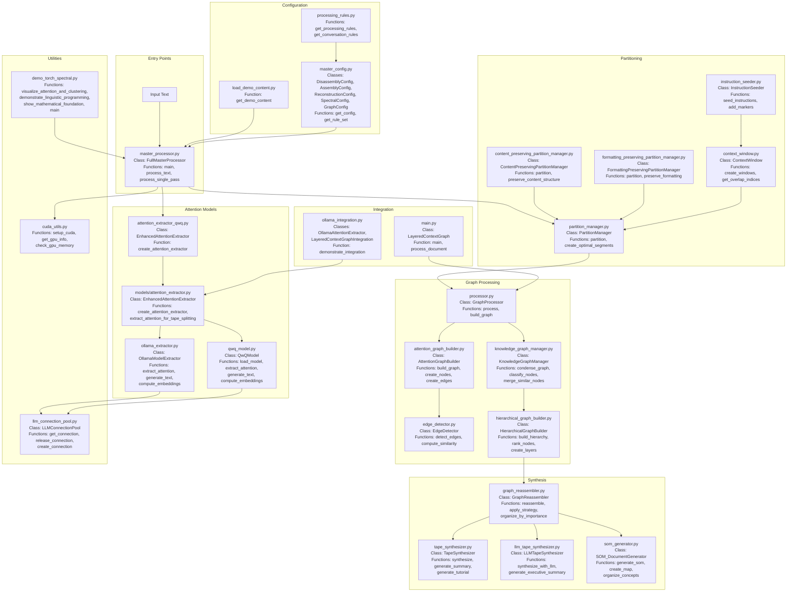

# Complete Project Architecture with All Functions

## Master Architecture Diagram

## All Functions by File

### Root Directory

**master_processor.py**
- `main()` - Entry point
- `process_text()` - Main processing function
- `process_single_pass()` - Single-pass processing

**master_config.py**
- `get_config()` - Get configuration for mode
- `get_rule_set()` - Get processing rules

**attention_extractor_qwq.py**
- `create_attention_extractor()` - Factory function

**demo_torch_spectral.py**
- `visualize_attention_and_clustering()`
- `demonstrate_linguistic_programming()`
- `show_mathematical_foundation()`
- `main()`

**load_demo_content.py**
- `get_demo_content()` - Load demo text

### Graph Processing

**processor.py**
- `process()` - Main graph processing
- `build_graph()` - Construct graph

**attention_graph_builder.py**
- `build_graph()` - Build attention-based graph
- `create_nodes()` - Create graph nodes
- `create_edges()` - Create graph edges

**edge_detector.py**
- `detect_edges()` - Find relationships
- `compute_similarity()` - Calculate similarity

**knowledge_graph_manager.py**
- `condense_graph()` - Merge similar nodes
- `classify_nodes()` - Categorize nodes
- `merge_similar_nodes()` - Combine duplicates

**hierarchical_graph_builder.py**
- `build_hierarchy()` - Create layers
- `rank_nodes()` - Importance ranking
- `create_layers()` - Organize by level

**graph_reassembler.py**
- `reassemble()` - Reconstruct document
- `apply_strategy()` - Apply reassembly strategy
- `organize_by_importance()` - Sort by significance

### Models

**attention_extractor.py**
- `create_attention_extractor()` - Factory
- `extract_attention_for_tape_splitting()` - Get attention

**qwq_model.py**
- `load_model()` - Load QwQ model
- `extract_attention()` - Get attention patterns
- `generate_text()` - Generate text
- `compute_embeddings()` - Get embeddings

**ollama_extractor.py**
- `extract_attention()` - Extract via Ollama
- `generate_text()` - Generate via Ollama
- `compute_embeddings()` - Embeddings via Ollama

**context_window.py**
- `create_windows()` - Make text windows
- `get_overlap_indices()` - Find overlaps

**instruction_seeder.py**
- `seed_instructions()` - Add instructions
- `add_markers()` - Insert markers

### Partitioning

**partition_manager.py**
- `partition()` - Main partitioning
- `create_optimal_segments()` - Optimize segments

**content_preserving_partition_manager.py**
- `partition()` - Partition preserving content
- `preserve_content_structure()` - Keep structure

**formatting_preserving_partition_manager.py**
- `partition()` - Partition preserving format
- `preserve_formatting()` - Keep formatting

### Synthesis

**tape_synthesizer.py**
- `synthesize()` - Generate output
- `generate_summary()` - Create summary
- `generate_tutorial()` - Create tutorial

**llm_tape_synthesizer.py**
- `synthesize_with_llm()` - LLM synthesis
- `generate_executive_summary()` - Exec summary

**som_generator.py**
- `generate_som()` - Create SOM
- `create_map()` - Build concept map
- `organize_concepts()` - Arrange concepts

### Integration

**main.py**
- `main()` - Alternative entry
- `process_document()` - Process doc

**ollama_integration.py**
- `demonstrate_integration()` - Demo function

### Utilities

**llm_connection_pool.py**
- `get_connection()` - Get LLM connection
- `release_connection()` - Release connection
- `create_connection()` - New connection

**cuda_utils.py**
- `setup_cuda()` - Initialize CUDA
- `get_gpu_info()` - GPU information
- `check_gpu_memory()` - Memory check

**processing_rules.py**
- `get_processing_rules()` - Get rules
- `get_conversation_rules()` - Conversation rules